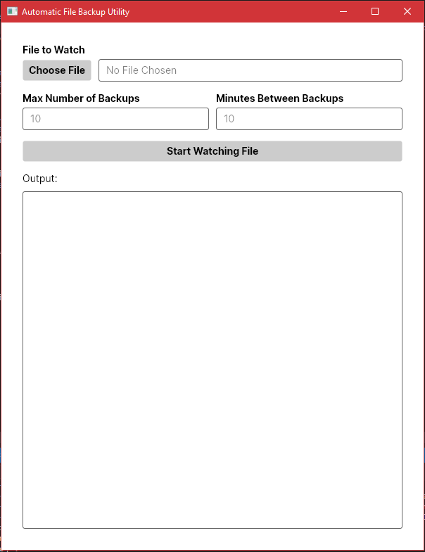

# Auto-File-Backup 1.0.0.0

A small utility program that watches a given file for changes and creates backups for you automatically whenever the file is changed.

## Features

* Command line version of the tool - just run `AutoFileBackup.exe --help` to get started.
* GUI version of the tool - just click `AutoFileBackupGUI.exe` to get started.
* You can specify how many backups to keep on hand - if the program goes over that number, it deletes the oldest backup. The default is 10.
* You can specify a minimum number of minutes that have to have passed before a new backup is created. The default is 10.
* A backup of the current version of the file is created on program start.
* If the watched file is deleted while the program is running, it gets restored from the most recent backup automatically.
* If the watched file is renamed while the program is running, it will still be watched, and all existing backups are renamed to reflect the change.


## Getting Started

* The current release was compiled for .NET 5.0; make sure you have [the latest version of .NET Runtime](https://dotnet.microsoft.com/download) installed.
* Download the latest release from the [Releases Page](https://github.com/egad13/Auto-File-Backup/releases).
* Unzip the zip file.
* Try out the program by running `AutoFileBackup.exe --help` in the command line, or opening up `AutoFileBackupGUI.exe`!

Do not move either `.exe` file out of the folder. You can create shortcuts to them anywhere you like, though.

On Windows, if you want to use the command line tool more easily, you can add `AutoFileBackup.exe` to one of your computer's PATH variables: [Instructions Here](https://helpdeskgeek.com/windows-10/add-windows-path-environment-variable/)

## Usage

From the command line:

```
AutoFileBackup.exe {h | help | -h | --help}
        Prints this help text.

AutoFileBackup.exe file_path [-m max_backups] [-t minutes_between_backups]
        file_path: The file to watch for changes.
        -m, --max: Optional. Default is 10. The maximum number of backups to create - older
                backups made during this run of the program will be deleted.
        -t, --time: Optional. Default is 10. The minimum amount of time in minutes that has
                to have passed between the most recent backup and the current file in order
                for a new backup to be created.
```

From the GUI:

Just pick a file, enter a maximum number of backups and a minimum number of minutes to wait between backups, and click "Start". The output window will update when the program does something, and you can stop it at any time by clicking "Stop".




## License

This project is licensed under the MIT License - see the [LICENSE](./LICENSE.md) file for details